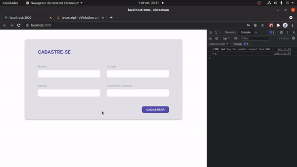

<h1 align="center">
    
</h1>

## 🏷️ Sobre 
**Form-app** é apenas uma aplicação que eu criei para estudar um pouco sobre validação e erros de formulários fazendo uso das lib's [react-hook-form](https://react-hook-form.com/) e [yup](https://github.com/jquense/yup). 

---

## 🛠️ Tecnologias utilizadas
Foram utilizadas as seguintes tecnologias para desenvolver a aplicação **Form-app** :

- [React](https://reactjs.org/)
- [Typescript](https://www.typescriptlang.org/)
- [SASS](https://sass-lang.com/documentation)
- [react-hook-form](https://react-hook-form.com/)
- [yup](https://github.com/jquense/yup)

---

## 🗂️ Como baixar e iniciar o projeto 

```bash

    #clonar o projeto
    $ git clone https://github.com/ElisioWander/form-app.git

    #entrar no diretório
    $ cd form-app

    #instalar as dependências
    $ yarn

    #iniciar a aplicação
    $ yarn start
```
### Servidor local
localhost:3000

---

## Autor
### 👤 Elisio Wander

- Linkedin: [@elisioWander](https://www.linkedin.com/in/elisio-wander-b88b69136/)
- github: [@elisioWander](https://github.com/ElisioWander)

---
## 📝 Licença
Copyright © 2020 [@ElisioWander]()

Este projeto está sobe a [LICENÇA MIT](https://opensource.org/licenses/MIT)

---

### Desenvolvido 💜 by Elisio Wander
